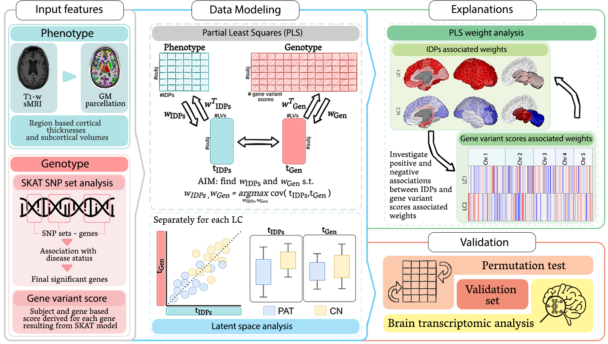
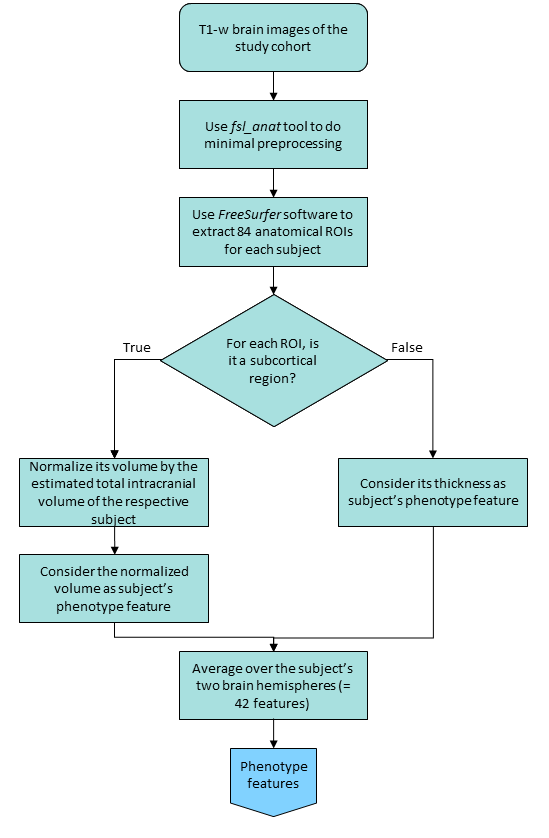
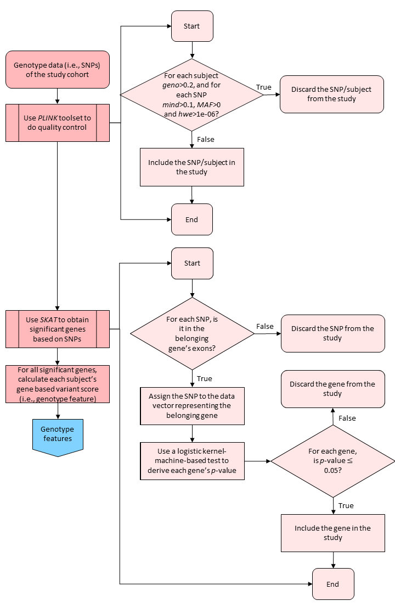

# PLS_ImagingGenetics
Public Repository for the paper 'Identifying the joint signature of brain atrophy and gene variant scores in Alzheimer's Disease' to appear in the Journal of Biomedical Informatics

<p align="center">

</p>
  
This repository contains the code related to two papers.

If you use this work, please cite:

*Identifying the joint signature of brain atrophy and gene variant scores in Alzheimer's Disease*

by Federica Cruciani, Antonino Aparo, Lorenza Brusini, Carlo Combi, Silvia F. Storti, Rosalba Giugno, Gloria Menegaz, Ilaria Boscolo Galazzo.

[[paper]](To appear)

BibTeX citation: [To appear]
```bibtex
```

# Usage

The data analysis and the directory is divided into input data processing and PLS modeling.  

## Data processing
### Imaging
The [`preprocessing/imaging`](https://github.com/fcrucian/PLS_ImagingGenetics/tree/main/preprocessing) contains the necessary file to reproduce the ADNI T1-weighted images preprocessing from data cleaning to region-based thickness and volume feature extraction.

<p align="center">

</p>

The tools needed for this step are:
* FSL version 6.0 [[link]](https://fsl.fmrib.ox.ac.uk/fsl/fslwiki)
* FreeSurfer version 7.0 [[link]](https://surfer.nmr.mgh.harvard.edu/)

To run the code:
TODO


N.B. Edits to the file names and paths could be needed according to your local file organization.

### Genetics
TODO

<p align="center">

</p>

## PLS modeling
TODO

## PLS explainability and validation

TODO


