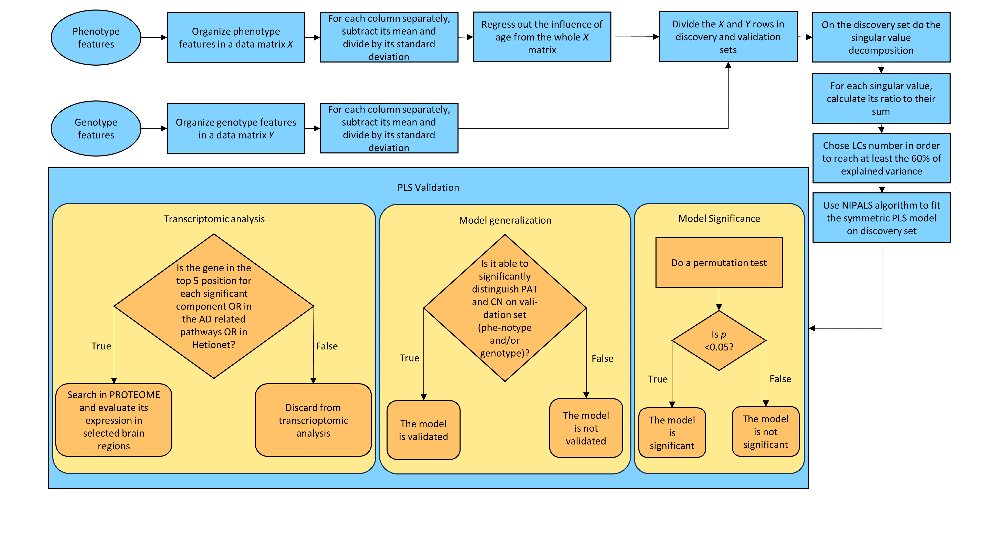

# PLS_ImagingGenetics
Public Repository for the paper 'Identifying the joint signature of brain atrophy and gene variant scores in Alzheimer's Disease' published in the Journal of Biomedical Informatics.

<p align="center">

</p>
  
If you use this work, please cite:

*Identifying the joint signature of brain atrophy and gene variant scores in Alzheimer's Disease*

by Federica Cruciani, Antonino Aparo, Lorenza Brusini, Carlo Combi, Silvia F. Storti, Rosalba Giugno, Gloria Menegaz, Ilaria Boscolo Galazzo.

[[paper link]](https://www.sciencedirect.com/science/article/pii/S1532046423002903)

BibTeX citation:
```bibtex
@article{CRUCIANI2023104569,
title = {Identifying the joint signature of brain atrophy and gene variant scores in Alzheimer’s Disease},
journal = {Journal of Biomedical Informatics},
pages = {104569},
year = {2023},
issn = {1532-0464},
doi = {https://doi.org/10.1016/j.jbi.2023.104569},
url = {https://www.sciencedirect.com/science/article/pii/S1532046423002903}
}
```

# Usage

The data analysis and the directory is divided into input data processing and PLS modeling.  

## Data processing
### Imaging
The [`preprocessing/imaging`](https://github.com/fcrucian/PLS_ImagingGenetics/tree/main/preprocessing) contains the file to reproduce the ADNI T1-weighted images preprocessing from data cleaning to region-based thickness and volume feature extraction.

<p align="center">

</p>

The tools needed for this step are:
* FSL version 6.0 [[link]](https://fsl.fmrib.ox.ac.uk/fsl/fslwiki)
* FreeSurfer version 7.0 [[link]](https://surfer.nmr.mgh.harvard.edu/)

To run the code:
```python
python imaging_preprocessing_and_feature_extraction.py
```
N.B. Edits to the file names and paths could be needed according to your local file organization.

### Genetics
The [`preprocessing/genetics`](https://github.com/fcrucian/PLS_ImagingGenetics/tree/main/preprocessing) contains the necessary file to reproduce the genetic data preprocessing from quality control step to gene variant score. The provided input files serve as a dummy example.
<p align="center">

</p>

The tools needed for this step are:
* R version >= 4.0 [[link]](https://www.r-project.org/)
* Plink version 1.9 [[link]](https://www.cog-genomics.org/plink/)

Plink executable must be located in the same folder  as the files in `preprocessing/genetics` . A compressed Plink version is contained in the `preprocessing/genetics` directory for both Windows and Unix versions. Alternatively, you can download it from the official website.

To perform this step, execute the `preprocessing/genetics/genetics_pipeline.R` file. The R SKAT library is automatically installed if it is not already.

Plink binary format files must be used as inputs. Specifically, these files are required:
* Plink bed, bim and fam files (Ex. 'Example1.bed','Example1.bim','Example1.fam')
* Plink covariate file (Ex. 'Example1.cov')
* Your own SetId file that contains information of SNP sets.  The SetID file is a white-space (space or tab) delimitered file with 2 columns: SetID and SNP_ID. (Ex. 'Example1.SetID)
Please keep in mind that there should be no header! The SNP_IDs and SetIDs should be less than 50 characters, otherwise, it will return an error message.

Example files can be found on `preprocessing/genetics/`.

Before running the R code, please customize these lines in the `genetics_pipeline.R` file according to your configuration:
```R
file_name="Example1"                #plink input file name without extension.
only_significant = TRUE             #gene variant score computed only for significant genes
threshold = 0.05                    #p-values threshold
remove_temporary = TRUE             #remove temporary file (located on 'tmp' directory in the working directory)
setwd(".")                          #set working directory
```

SKAT results are saved in 'SKAT_results.txt' in the working directory.
The genetic preprocessing results, used as input for PLS, will be stored in matrix format within the 'genetics_output.raw' file (space-separated ). Rows correspond to subjects, columns to genes, with each cell containing the respective gene mutation score.

For more information, please refer to the SKAT reference manual and vignettes [[link]](https://cran.r-project.org/web/packages/SKAT/index.html).

## PLS modeling
The [`PLS`](https://github.com/fcrucian/PLS_ImagingGenetics/tree/main/PLS) contains the files to compute the PLS modeling once input features have been extracted.

<p align="center">

</p>

The tools needed for this step are:
* Python (version > 3)
* Python libraries:
  * numpy, scipy, matplotlib, seaborn, scikit-learn, pandas, statannot, datetime

To perform this step run the [PLS/main.py](https://github.com/fcrucian/PLS_ImagingGenetics/blob/main/PLS/main.py) file.

Input requirements: X and Y matrices should be N x F_x and N x F_y respectively where:
  * N is the number of subjects (the same for both X and Y matrices)
  * F_x is the number of X features
  * F_y is the number of Y features

The code generates random X and Y matrices which should be changed according to your input files.

Before running the sample python code please customize these lines in the [PLS/main.py](https://github.com/fcrucian/PLS_ImagingGenetics/blob/main/PLS/main.py) file according to your configuration:
```python
path_out = "./"                  # save path
x_variable = 'Imaging'           # X matrix name
y_variable = 'Genetics'          # Y matric name
experiment_name = 'PLS_test'     # experiment name for report naming
```
The code will automatically generate a pdf report file including the preprocessing performed on data (standardization and/or deconfounding), the chosen PLS components number, the latent space projection separating samples in classes as well as the PLS scores barplot. Finally the permutation test to assess model significance will be computed.

The PLS weights will be saved in csv files in order to visualize them with the preferred tool (e.g. in our work [brainpainter](https://github.com/razvanmarinescu/brain-coloring) was used for displayng the imaging weights).

## Transcriptomic analysis

The file [transcriptomic_analysis.py](https://github.com/fcrucian/PLS_ImagingGenetics/blob/main/PLS/transcriptomic_analysis.py) allows to replicate the transcriptomic ana
The transcriptomic analysis was performed relying Human Protein Atlas (HPA) database [proteinatlas.org](https://www.proteinatlas.org/). 


